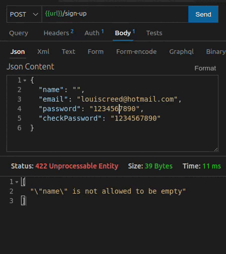

<div align="center"> 
	<h1> DrivenPass </h1>
<div />

19th project project at Driven Education.

A password manager API.

 ### Technologies
<p align="center">
  <a href="https://skillicons.dev">
    
  </a>
</p>

<br>	

	
<div align="start"> 

## 🏁 Running this project
	
Before starting, you will need to have the following tools installed on your machine: Postgres, Node.js.

Besides, it's good to have an editor to work with the code like VSCode.
	
```
	
# First, clone this repository.
$ git clone https://github.com/emilynakano/drivenpass-back.git

# Acces this repository.
$ cd drivenpass-back

# Go to the '.env.example' in your code editor.
	
# Put your DATABASE_URL, which must be a url of an empty database made with postgres.
# Put your PORT, which must be a port of the aplication.
# Put your JWT_SECRET_KEY, which is a key that must be a string.
# Put your CRYPT_SECRET_KEY, which is a key that must be a string.
	
# Finally, make a copy of '.env.example' to '.env'.
$ cp .env.example .env

# Install dependencies.
$ npm i -y

# Build.
$ npm run build
	
# Run the project in the developer mode.
$ npm run dev	
	
```

**NOTE:** There is a Thunder Client collection in this project's folder, it contains all the project routes with an example request body. To use it you will need to import it into your Thunder Client and put the url you are using.
	
<div />
	
<br>

## 🧑🏻‍🏭 Working Flow

<div align="start"> 

1. User creates a login (name, email, password).

2. User logs in and receives a token.

3. User creates a register using one of the categories (credentials/networks/cards/notes).

4. User can access the register according to the category, either searching all or one in specific.

</div>


<br>

<div align="start" >
  
</div>

<br>

## 🚀 Routes

<div align="start"> 

  ### User Registration
  
  POST /sign-up
  
  Send a request body in this format:
  

```
{
    name: Fulano,
    email: fulano@gmail.com,
    password: 1234567890,
    checkPassword: 1234567890
}
```
<div />

<div align="start"> 

  ### User Login
  
  POST /sign-in
  
  Send a request body in this format
  

```
{
    email: fulano@gmail.com,
    password: 1234567890
}
```

The server will respond with an object in this format:

```
{
    token: jyJhbGciOiJIUzI1NiIsInR5cCI6IkpXVCJ9
}
```
<div />

<div align="start"> 

  ### Credential Creation</h2>
  
  POST /credentials
  
  Send a Authorization Header with format Bearer Token, and  a Request Body in this format:
  

```
{
  "title": "twitter"
  "url": "https://mobile.twitter.com/" , 
  "username": "twitterUser", 
  "password": "twitterPassword"
}
```
<div />

<div align="start"> 
   
   ### Get User Credentials
   
  GET /credentials
  
  Send a Authorization Header with format Bearer Token.
  
  The server will respond with an array in this format:
  

```
[
  {
    "id": 1,
    "title": "twitter"
    "url": "https://mobile.twitter.com/" , 
    "username": "twitterUser", 
    "password": "twitterPassword"
  }
] 
```
<div />

<div align="start"> 
  
  ### Get Credential By Id
 
  GET </span> /credentials/:id
  
  Send a Authorization Header with format Bearer Token.
  
  Replace ":id" to desired id
  
  The server will respond with an object in this format: 
  

```
{
  "id": 1,
  "title": "twitter"
  "url": "https://mobile.twitter.com/" , 
  "username": "twitterUser", 
  "password": "twitterPassword"
}
```
<div />
	
<div align="start"> 
  
  ### Delete Credential
 
  DELETE /credentials/:id
  
  Send a Authorization Header with format Bearer Token.
  
  Replace ":id" to desired id
  
  The server will respond with status 200 if the request is successful.

<div />

<br />
	
<div align="start"> 

  ### Network Creation</h2>
  
  POST /networks
  
  Send a Authorization Header with format Bearer Token, and  a Request Body in this format:
  

```
{
  "title": "neighbor's wifi"
  "networkName": "5g-Net" , 
  "password": "neighborPassword"
}
```
<div />

<div align="start"> 
   
   ### Get User Networks
   
  GET /networks
  
  Send a Authorization Header with format Bearer Token.
  
  The server will respond with an array in this format:
  

```
[
 {
   "id": 1,
   "title": "neighbor's wifi"
   "networkName": "5g-Net" , 
   "password": "neighborPassword"
 }
] 
```
<div />

<div align="start"> 
  
  ### Get Network By Id
 
  GET </span> /networks/:id
  
  Send a Authorization Header with format Bearer Token.
  
  Replace ":id" to desired id
  
  The server will respond with an object in this format: 
  

```
{
  "id": 1,
  "title": "neighbor's wifi"
  "networkName": "5g-Net" , 
  "password": "neighborPassword"
}
```
<div />

<div align="start"> 
  
  ### Delete Network
 
  DELETE /networks/:id
  
  Send a Authorization Header with format Bearer Token.
  
  Replace ":id" to desired id
  
  The server will respond with status 200 if the request is successful.

<div />

<br />
	
<div align="start"> 

  ### Card Creation</h2>
  
  POST /cards
  
  Send a Authorization Header with format Bearer Token, and  a Request Body in this format, with the type field valid for "debit", "credit" and "both":
  

```
{
  "number": "1234567892345678",
  "title": "card to buy snacks",
  "holderName": "Fulano S Oliveira",
  "securityCode": "123",
  "expirationDate": "04/21",
  "password": "passwordCard",
  "isVirtual": true,
  "type": "debit"
}
```
<div />

<div align="start"> 
   
   ### Get User Cards
   
  GET /cards
  
  Send a Authorization Header with format Bearer Token.
  
  The server will respond with an array in this format:
  

```
[
 {
  "id": 1,
  "number": "1234567892345678",
  "title": "card to buy snacks",
  "holderName": "Fulano S Oliveira",
  "securityCode": "123",
  "expirationDate": "04/21",
  "password": "passwordCard",
  "isVirtual": true,
  "type": "debit"
 }
] 
```
<div />

<div align="start"> 
  
  ### Get Card By Id
 
  GET /cards/:id
  
  Send a Authorization Header with format Bearer Token.
  
  Replace ":id" to desired id
  
  The server will respond with an object in this format: 
  

```
 {
  "id": 1,
  "number": "1234567892345678",
  "title": "card to buy snacks",
  "holderName": "Fulano S Oliveira",
  "securityCode": "123",
  "expirationDate": "04/21",
  "password": "passwordCard",
  "isVirtual": true,
  "type": "debit"
 }
```
<div />
	
<div align="start"> 
  
  ### Delete Card
 
  DELETE /cards/:id
  
  Send a Authorization Header with format Bearer Token.
  
  Replace ":id" to desired id
  
  The server will respond with status 200 if the request is successful.

<div />

<br />

<div align="start"> 

  ### Note Creation</h2>
  
  POST /notes
  
  Send a Authorization Header with format Bearer Token, and  a Request Body in this format:
  

```
{
  "title": "secret tought",
  "note": "I want to break the diet and eat a lot of ice cream" , 
}
```
<div />

<div align="start"> 
   
   ### Get User Notes
   
  GET /notes
  
  Send a Authorization Header with format Bearer Token.
  
  The server will respond with an array in this format:
  

```
[
 {
  "id": 1,
  "title": "secret tought",
  "note": "I want to break the diet and eat a lot of ice cream" , 
 }
] 
```
<div />

<div align="start"> 
  
  ### Get Note By Id
 
  GET /notes/:id
  
  Send a Authorization Header with format Bearer Token.
  
  Replace ":id" to desired id
  
  The server will respond with an object in this format: 
  

```
{
  "id": 1,
  "title": "secret tought",
  "note": "I want to break the diet and eat a lot of ice cream" , 
}
```
<div />

<div align="start"> 
  
  ### Delete Note
 
  DELETE /notes/:id
  
  Send a Authorization Header with format Bearer Token.
  
  Replace ":id" to desired id
  
  The server will respond with status 200 if the request is successful.

<div />

